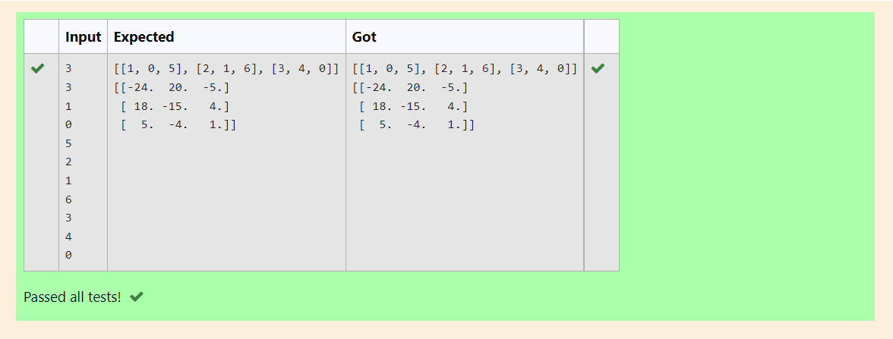

# Inverse-of-matrix

## AIM:
To write a python program to find the inverse of a matrix.

## ALGORITHM:
### Step 1:
Import Numpy module as np.

### Step 2:
Create empty lists.

### Step 3:
Get input from the user for number of rows and columns.

### Step 4:
Use nested lists to append list.

### Step 5:
Print the inverse of the array using np.linalg.inv

## PROGRAM:
```
#To find the inverse of a matrix
#Developed By:S.S.Sanjay Kumar
#Register Number:21005845

import numpy as np
x=int(input())
y=int(input())
B=[]
A=[]
for i in range(x):     
    for j in range(y):      
         A.append(int(input()))
    B.append(A)
    A=[]
print(B)
print(np.linalg.inv(B))
```
## OUTPUT:


## RESULT:
Thus a program is written to find the inverse of the matrix.